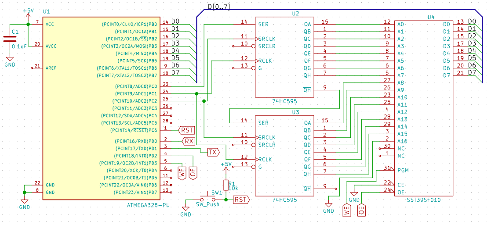

# flash_programmer
Programs the SST39SF010A and probably other JEDEC-compatible flash chips too.

# Circuit

The circuit is essentially ATMEGA328P on a breadboard, connected to two 74HC595 shift registers. The shift registers are chained to each other, and connected to the flash chip's address bus. Port B of the MCU is connected to the flash chip's data bus.

This would require modifications to work on an Arduino Uno or an ATMEGA328P with external crystal because the crystal is connected to port B, which is used here for data. It _should_ work on other JEDEC-compatible flash chips but you should check the datasheet of that chip to make sure that the software data protection routine and things like that are the same. In addition, this will only be able to program the first 32 KiB. Accessing more than that would require an additional shift register and code changes. (right now the code assumes address is a `short`)

# Usage 
Open the serial monitor set to 9600 baud with "Newline" and you should see a menu like this:

    b: bulk write bytes
    c: erase chip
    e: erase a sector
    i: identify chip
    r: read a byte
    w: write a byte
    x: examine memory block

Type in the letter corresponding to what you want to do and respond to the questions it asks you. If it does not work, you might have to check that the variables at the top of the program are set to the proper pin numbers, and that you have not switched the two shift registers.
